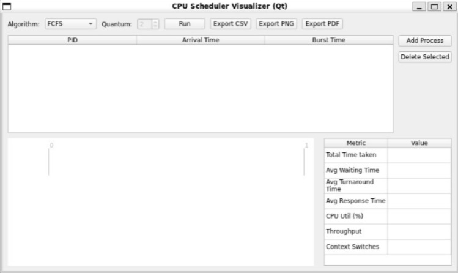
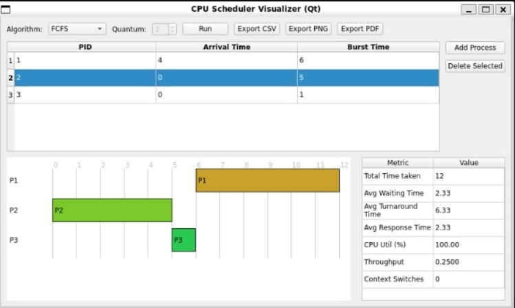

# CPU Scheduler Simulator
## Project Overview
The CPU Scheduler Simulator is a desktop application implemented in modern C++ and Qt, designed to simulate and visualize CPU scheduling algorithms. This project allows users to understand how processes are scheduled, analyze scheduling metrics, and export results in multiple formats including CSV, PDF, and PNG.

The simulator supports multiple algorithms and provides an intuitive interface for adding processes, running simulations, and visualizing results with Gantt charts.





## Key goals

- Schduling Algorithms supported-
    - First-Come, First-Served (FCFS)
    - Shortest Job First (SJF)
    - Shortest Remaining Time First (SRTF)
    - Round Robin (RR)
- Process Management- User can add, edit and delete tasks, specify attributes: arrival time, burst time for each task
- Simulation Metrics- Compute average waiting time, turnaround time, and CPU utilization
- Visual interactive- Generate Gantt charts for visual representation
- Export Functionality- Users can eport the final metrics and gantt charts as CSV, PNG or PDF files.


## Architecture Overview
The simulator is organized into modular components for tasks, scheduling logic, and GUI:
```bash
cpu-scheduler/
├── gui/                      # Qt-based GUI components
│   ├── mainwindow.cpp        # Main window implementation
│   ├── mainwindow.hpp           
│   ├── ganttidget.cpp        # Gantt chart visualization 
│   ├── ganttidget.hpp 
│   ├── CMakeLists.txt        # CMake build configuration
│   └── main.cpp              # Application entry point for frontend
├── src/                      # Core simulation logic
│   ├── main.cpp              # Application entry point for backend
│   ├── simulator.cpp         # CPU scheduling simulation logic
│   ├── simulator.hpp
│   ├── implementation.cpp    # Algorithm implementations
│   ├── scheduler.hpp
│   └── CMakeLists.txt        # CMake build configuration
├── CMakeLists.txt            # CMake build configuration
├── .gitignore                # Git ignore file
└── README.md                 # This file
```


## Build and Run

### 1. Clone the repository

```bash
git clone https://github.com/insane-22/cpu-scheduler
cd cpu-scheduler
```

### 2. Run Application

```bash
# create and enter build directory
mkdir -p build && cd build

# cmake .. 
cmake .. 
make -j$(nproc)

# run executable
./gui/cpu_scheduler_qt
```

## Usage Example
- Launch the application.
- Add processes with attributes: PID, arrival time, burst time.
- Select a scheduling algorithm (e.g., Round Robin with quantum = 2).
- Click Run Simulation.
- View the Gantt chart and statistics.
- Export results using CSV, PDF, or PNG buttons.

